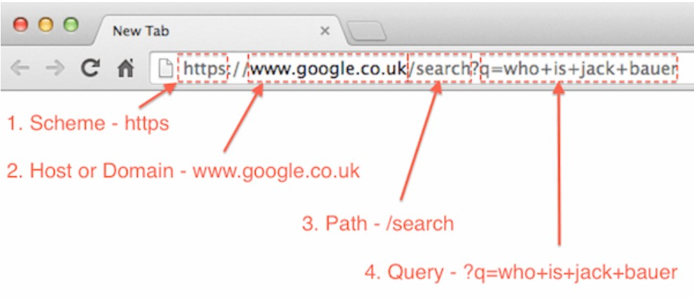

# Práctica 13: Query string

> Segunda Parcial

- FACULTAD DE TELEMATICA
- INGENIERÍA EN SOFTWARE
- “4ºG”
- PROGRAMACIÓN WEB
- CATEDRATICO: ULIBARRI IRETA CARLOS
- AGUIRRE ROMERO RAMÓN ALEJANDRO

## OBJETIVO

El query string o “cadena de consulta” es un mecanismo comúnmente utilizado para pasar información en peticiones HTTP. Podemos identificar un query string de la siguiente forma:

en el encabezado, podemos identificar elementos que hemos abordado previamente, como el protocolo (HTTP/HTTPS), el URL, la ruta (path) para el cual hemos escrito un “route handler”, y después, seguido del signo de interrogación “?”, el “query string”.

Cuando la petición HTTP es del tipo GET, el query string es enviado en el “Header” del paquete HTTP

En cambio, cuando la petición es mediante POST, el query string es “movido” hacia el “body” y para acceder a su contenido es necesario “parsear” el contenido del “Body” de la petición y obtener la información. La información que “viaja” durante la petición, puede ser en formato de texto o en formato JSON, dependiendo de la necesidad.

Para “sacar” la información del Query string, en el caso de un método GET, es relativamente sencillo debido a que “Express” ya hace el “parseo” de lo query string y nos permite acceder a la colección de parámetros mediante la notación del “.” punto.

> ENTREGA: JUEVES 28 DE ABRIL DEL 2022

## EXPLICACIÓN DEL PROCESO

1. Crea una carpeta llamada "practica_12"

2. Inicializa NPM con npm init -y

3. Instala los paquete express con npm i express y nodemon con npm install -g nodemon

4. Instala el paquete 'ejs' con el comando npm i express --save o npm i ejs

5. Crea un nuevo archivo app.js en el cual se le pasara todo el codigo hecho en la practica anterior

6. Crea una nueva carpeta llamada "public" dentro de la carpeta "practica_12"

7. Dentro de la carpeta "public" crea un nuevo archivo style.css

8. Dentro del archivo style.css se le escribira body y dentro de este tendra un front-family : 'Roboto Condensed', sans-serif;

9. En el archivo app.js con el app.use donde tenemos la carpeta virtual llamada "assets" y ese nombre sera mapeado con la carpeta fisica llamada "public"

10. Despues de la linea cuatro se inserta el codigo con el que se espesifica la app de express y su engine ejs

11. Ahora se crea una carpeta al nivel de public la cual se llamara Views y dentro de esta se creara un archivo llamado numbers.ejs

12. Ahora se ingresa el codigo igual como se realiza en html.

13. Pero dejeremos ejecutar scripts de JS para poder realizar el ejercicio para hacerlo deberemos utilizar <% %> esa sentencia y dentro de ella colocar los scripts para que lo pueda ejecutar desde el ejs

14. Regresando al app.js en la ruta numbers colocaremos res.render("numbers", { number: req.params.id }); para que tome el numero y lo mande

15. Ahora se ejecuta el comando "nodemon app” en la terminal y acccede a localhost:3000/numbers/6 para observar el resultado

16. tambien se puede observar el resultado con un numero impar

## RECURSOS

- https://www.npmjs.com/
- https://ejs.co/
